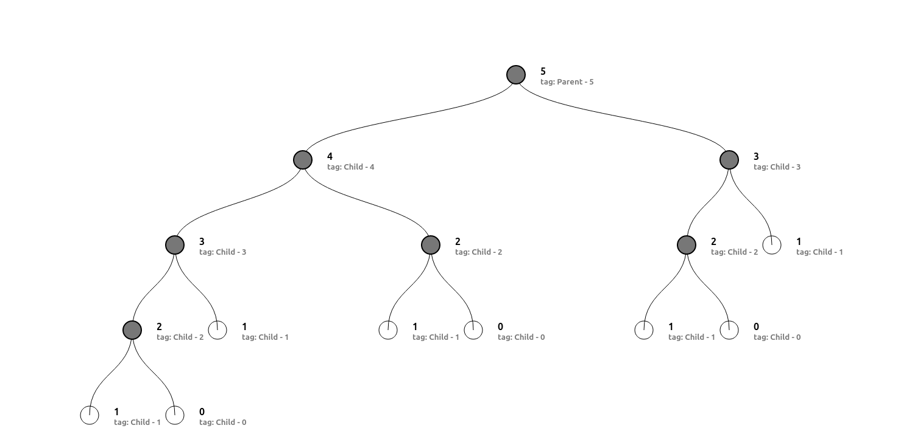

# Programa para calcular la Serie Fibonacci con árbol de ejecución  (Español)

## Introduccion

El presente programa busca resolver la serie Fibonacci mediante programación recursiva obteniendo el resultado de esta y dibujando un árbol de la ejecución de este algoritmo.

## Serie Fibonacci

La serie de Fibonacci es una secuencia matemática infinita de números en la cual cada número es la suma de los dos anteriores. La secuencia comienza generalmente con los números $0 y 1$.
La secuencia de Fibonacci se define de la siguiente manera:
$$0, 1, 1, 2, 3, 5, 8, 13, 21, 34, 55, 89, ...$$
Los primeros dos números de la secuencia son $0 y 1$. A partir de ahí, cada número subsiguiente se obtiene sumando los dos números anteriores. Por ejemplo, el tercer número es $0 + 1 = 1$, el cuarto número es $1 + 1 = 2$, el quinto número es $1 + 2 = 3$, y así sucesivamente.

La secuencia de Fibonacci tiene muchas propiedades interesantes y se encuentra en varios contextos en matemáticas, ciencias naturales y programación. Se utiliza ampliamente como un ejemplo de recursión y se puede encontrar en fenómenos naturales, como el crecimiento de las plantas, la forma de las conchas de caracol y la distribución de pétalos en flores.

## Sobre el autor

Leonardo de Pisa, también conocido como Leonardo Fibonacci, fue un matemático italiano nacido alrededor del año 1170 en Pisa, Italia, y fallecido después de 1240. Es conocido principalmente por su obra "Liber Abaci", en la que introdujo y popularizó en Europa los números arábigos y el sistema decimal posicional.

Leonardo Fibonacci viajó extensamente por el Mediterráneo y estudió matemáticas en varias escuelas árabes. Durante sus viajes, adquirió conocimientos sobre los sistemas numéricos y las técnicas matemáticas utilizadas en el mundo árabe, que eran más avanzados que los métodos romanos que se utilizaban en Europa en ese momento.

En su libro "Liber Abaci", Fibonacci presentó y promovió el uso de los números arábigos, incluyendo el cero, así como el sistema decimal posicional. Estos conceptos tuvieron un impacto significativo en la aritmética y la práctica comercial de la época, y ayudaron a popularizar el sistema numérico que utilizamos actualmente.
Además de su contribución al sistema numérico, Fibonacci también introdujo la secuencia de Fibonacci en "Liber Abaci". Aunque la secuencia no fue descubierta por él, Fibonacci la presentó como un ejemplo en un problema sobre el crecimiento de una población de conejos y, posteriormente, se convirtió en uno de los conceptos matemáticos más conocidos y estudiados.

Leonardo de Pisa dejó un legado importante en el campo de las matemáticas, particularmente en el ámbito de los sistemas numéricos y la secuencia de Fibonacci. Su trabajo fue fundamental para la difusión de las matemáticas árabes en Europa y tuvo un impacto duradero en el desarrollo de las matemáticas y la ciencia en general.

## Ejemplo del árbol de ejecuccion

# Program to calculate the Fibonacci Series with execution tree (english)

## Introduccion

El presente programa busca resolver la serie Fibonacci mediante programación recursiva obteniendo el resultado de esta y dibujando un árbol de la ejecución de este algoritmo.

## Serie Fibonacci

La serie de Fibonacci es una secuencia matemática infinita de números en la cual cada número es la suma de los dos anteriores. La secuencia comienza generalmente con los números $0 y 1$.
La secuencia de Fibonacci se define de la siguiente manera:
$$0, 1, 1, 2, 3, 5, 8, 13, 21, 34, 55, 89, ...$$
Los primeros dos números de la secuencia son $0 y 1$. A partir de ahí, cada número subsiguiente se obtiene sumando los dos números anteriores. Por ejemplo, el tercer número es $0 + 1 = 1$, el cuarto número es $1 + 1 = 2$, el quinto número es $1 + 2 = 3$, y así sucesivamente.

La secuencia de Fibonacci tiene muchas propiedades interesantes y se encuentra en varios contextos en matemáticas, ciencias naturales y programación. Se utiliza ampliamente como un ejemplo de recursión y se puede encontrar en fenómenos naturales, como el crecimiento de las plantas, la forma de las conchas de caracol y la distribución de pétalos en flores.

## Sobre el autor

Leonardo de Pisa, también conocido como Leonardo Fibonacci, fue un matemático italiano nacido alrededor del año 1170 en Pisa, Italia, y fallecido después de 1240. Es conocido principalmente por su obra "Liber Abaci", en la que introdujo y popularizó en Europa los números arábigos y el sistema decimal posicional.

Leonardo Fibonacci viajó extensamente por el Mediterráneo y estudió matemáticas en varias escuelas árabes. Durante sus viajes, adquirió conocimientos sobre los sistemas numéricos y las técnicas matemáticas utilizadas en el mundo árabe, que eran más avanzados que los métodos romanos que se utilizaban en Europa en ese momento.

En su libro "Liber Abaci", Fibonacci presentó y promovió el uso de los números arábigos, incluyendo el cero, así como el sistema decimal posicional. Estos conceptos tuvieron un impacto significativo en la aritmética y la práctica comercial de la época, y ayudaron a popularizar el sistema numérico que utilizamos actualmente.
Además de su contribución al sistema numérico, Fibonacci también introdujo la secuencia de Fibonacci en "Liber Abaci". Aunque la secuencia no fue descubierta por él, Fibonacci la presentó como un ejemplo en un problema sobre el crecimiento de una población de conejos y, posteriormente, se convirtió en uno de los conceptos matemáticos más conocidos y estudiados.

Leonardo de Pisa dejó un legado importante en el campo de las matemáticas, particularmente en el ámbito de los sistemas numéricos y la secuencia de Fibonacci. Su trabajo fue fundamental para la difusión de las matemáticas árabes en Europa y tuvo un impacto duradero en el desarrollo de las matemáticas y la ciencia en general.

## Ejemplo del árbol de ejecuccion

